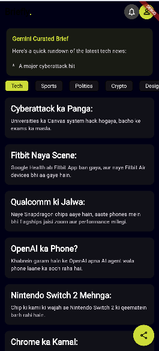
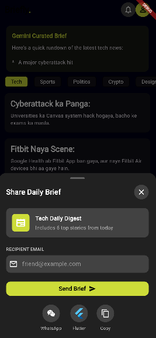
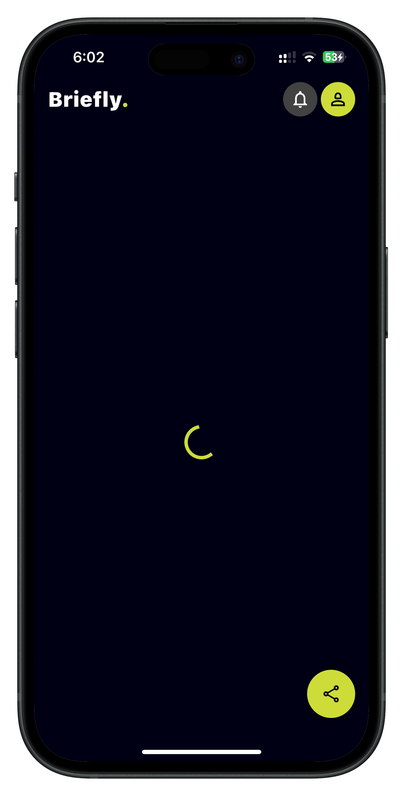

# Briefly

Briefly is a Flutter news reader that combines a baseline news feed with a Gemini-powered curated summary of the latest tech stories. This submission keeps the existing Bloc structure and adds a second remote datasource that calls Gemini directly to generate a concise brief from the fetched headlines.

## Group Submission

- Group 6
- Murtaza Johar - 22K-4508
- Shahmir Ahmed Khan - 22K-4414
- Saad Ahmed - 22K-4345
- Haseeb Mujtaba - 22K-4307

## What Changed

- Added a Gemini datasource that calls the Gemini 2.5 Flash API directly.
- Extended the repository and Bloc so the screen receives both the raw news cards and a curated AI summary.
- Updated the home feed UI to show the Gemini summary above the article list.
- Kept the API key out of source control and configured the app to read it at build time.

## Screenshots

<div align="center">
  
  
  
</div>

## New Code Snippets

Key parts of the implementation are in the following files:

- [Gemini datasource](lib/data/datasources/gemini_summary_data_source.dart)
- [Repository orchestration](lib/data/repositories/news_repository.dart)
- [Bloc state and event flow](lib/bloc/news_bloc.dart)
- [Feed UI](lib/presentation/screens/news_screen.dart)

## Architecture

The app follows a simple Bloc-based structure:

```
lib/
├── bloc/              # BLoC layer
├── data/              # Data layer
│   ├── datasources/   # Remote data sources
│   ├── models/        # Data models
│   └── repositories/  # Repository implementations
└── presentation/      # UI layer
    ├── screens/       # App screens
    └── widgets/       # Reusable widgets
```

## Features

- Tech news feed sourced from the existing remote news endpoint
- Gemini-generated curated summary for the current set of stories
- Bloc state management with pull-to-refresh
- Share Daily Brief bottom sheet UI
- Dark UI with a high-contrast lime accent

## Gemini API Setup

Do not commit your API key to the repository.

1. Create an API key in Google AI Studio.
2. Run the app with a build-time define:

```bash
flutter run --dart-define=GEMINI_API_KEY=YOUR_KEY_HERE
```

For release builds, pass the same `--dart-define` flag to `flutter build`.

## Local Run

```bash
flutter pub get
flutter run --dart-define=GEMINI_API_KEY=YOUR_KEY_HERE
```

## Submission Notes

This repository is intended to be submitted as a fork of the shared class repo. Include the group names, updated screenshots, and the final code snippets in your submission notes or PR description.

## License

This project is part of the class workshop submission.
